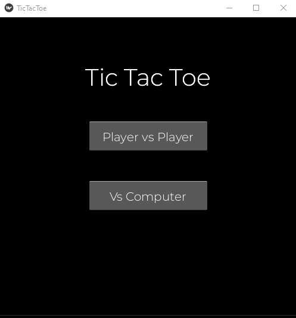

<!--  -->

<h1>Hello world!</h1>

This is my repository where I track my progress throughout <strong>[100 Days of Code: The Complete Python Pro Bootcamp](https://www.udemy.com/course/100-days-of-code/)</strong> course by <strong>Angela Yu</strong>. Here, you'll find projects that showcase my journey in mastering Python. 

The goal of the course was to take me from understanding basic Python concepts, to exploring libraries specializing in GUI, game development, APIs, web develompent, relational databases, automation, data science. Finally making my own portfolio projects where I decided I want to go an extra mile and make something special in more than one day!

<h3 style='color:crimson; text-align: center;'>Only projects from day 82-100 are done entirely by me!</h3>

Projects below are ordered from the most recent to the latest.

<h2>Day 96 - Cat browsing website</h2>

Stack: <b>django, bootstrap5</b>

I created a website where cat fans can browse and discover interesting facts about various cat breeds! This project is my first experience with the Django framework, aimed at building a functional website that allows users to register, log in, and browse cat pictures provided by The Cat API. The first challenge was implementing a sidebar with an expansion effect, revealing options to redirect users to the main page, profile, browsing content, login/logout, and registration. The homepage, where all the content is located, offers options to browse random cats, cats by breed, an explorer page for viewing pictures of 30 random cats, and browsing saved favorite cats. Next steps included creating a cat characteristics page that describes each breed, implementing a smart autofill feature for available cat breeds, and an AJAX response to save favorite cats.

<h2>Day 95 - Space Invaders Game</h2>

Stack: <b>pygame</b>

2D game where the player's goal is to destroy enemy spaceships in order to save humanity. This is another game made in pygame. As I was already somewhat familiar with the stack, I've decided to focus on improving my "object-oriented code writing". Compared to the previous game I've made (Breakout Game), I've introduced more gameplay mechanics such as sliding effect of the player's movement, moving enemies, and in-game music/sound effects.

<h2>Day 94 - Google Chrome's Dino Game Automation</h2>

Stack: <b>OpenCV, win32, Selenium, NumPy</b>

This project's goal was to create a script that will automate Google's Chrome Dino Game. The goal of the game is to dodge obstacles in the form of cacti and pterodactyls as the game speeds up. I've approached this problem in two ways, by using OpenCV and ray casting.

1. <b>OpenCV approach</b> - Script firstly opens a browser, and starts capturing specific region using win32 API - this allows for screen capture even when the window is covered by other window. The key mechanic of detection is being executed by OpenCV <u>matchTemplate</u> function that utilizes normalized correlation coefficient. This function screens the captured window to find the image we are looking for (objects to dodge), draws a rectangle around them and gets their coordinates. Based on how close is the x coordinate to the left side of the screen, the space bar is being hit which makes Dino jump, thus dodging the obstacle.

2. <b>Ray cast approach</b> - The difference between this approach and OpenCV is the way it detects the obstacle. These methods just monitors one pixel high line that is placed across the game screen, allowing it to detect all the objects the player is supposed to dodge. The line in question just as previously is being captured by win32 API. The core mechanic of this script is to collect the most common BGR pixels value within this line and whenever another pixel color appears (which causes the homogeneity of colors within the array to not be 100%) it makes Dino jump. Detecting a pixel by just one BGR value wouldn't work because. In this project, I've also tried utilizing threading of screen capture to improve performanc

The motive behind creating two different approaches to the problem was to improve performance of game being successful in dodging obstacles. The second method captures way smaller screen and avoids using the computationally expensive <u>matchTemplate</u> function, thereby enhancing performance. However, even after applying that with multi-threading methods wasn't enough to fully automate seemingly simple game to being played flawlessly.

<h2>Day 93 - LinkedIn Job Description Scraper</h2>

Stack: <b>Selenium, GCP - Google Sheets API</b>

Possibly my favorite project because it taught me how can I independently collect my own data. Wondering about my future career, I've started collecting data about a variety of entry-level and junior coding jobs that are being posted on LinkedIn. The goal was to collect technology/stack related keywords and check their count for each job title. The script firstly navigates to those postings and scrapes all their bullet points. Having initial data I've started initial keyword analysis, which has been done by filtering out the special characters and negative keywords ("and", "or", "if" and so on), then removing bullet points which had nothing to do with job requirements (benefits, salary etc.), finishing on manual inspection of 500 most common words. This gave me the list of positive keywords. Having that, I wrote the script that counts those keywords in job postings in each job title of my interest, then save it in Google Spreadsheets.

<h2>Day 92 - Image Color Palette Generator</h2>

Stack: <b>Flask, PIL, NumPy</b>

Web application that allows users to find the most common colors in an uploaded image. The file user uploaded gets temporarily saved in dedicated folder then deleted after 10 seconds using threading, this is enough time for the application to view the image and process its pixels to find the top 10 most common color and display they hexcode with percentage of occurrence.

<h2>Day 91 - PDF to Audiobook Converter</h2>

Stack: <b>Pyside6, pyttsx3, pymupdf</b>

Desktop application that lets you load any pdf file of your liking and convert it into audiobook using system's registry voice. User is greet with the small interface where they have option open their pdf, then after clicking convert the loading bar appears which depending on pdf file size can take up to couple of minutes to create an audiobook in mp3 extension.

<h2>Day 90 - Disappearing Text Web application</h2>

Stack: <b>Flask, HTML/CSS/JS</b>

Web application where user is forced to keep writing or their text will be deleted. It is designed to encourage uninterrupted writing without overthinking. This project mostly improved my usage of JavaScript's event listeners.

<h2>Day 89 - To-do List</h2>

Stack: <b>Flask, HTML/CSS/JS</b>

Web application to create your to-do list. By implementing specific JavaScript functions, I learned how to create a more interactive and efficient interface. User can input their taks and create a list which contents of will be saved thanks to browser cookies ensuring it's preserved even if they close the tab.

<h2>Day 88 - Café Finder</h2>

Stack: <b>Flask, HTML/CSS/JS, GCP - Places API</b>

Web application that allows users to find nearby cafés in Poland using Google Places API. The user is able to type in the search bar city or neighborhood of their choice and find 20 nearby places to drink coffee. This was my first contact using could service, the toughest elements of this project were to implement autocomplete option to the search bar, then optimizing both search performance and costs by implementing caching.

<h2>Day 87 - Breakout Game</h2>

Stack: <b>pygame</b>

Game where the player has to use paddle and ball to hit all the bricks. Biggest hurdle was designing rebounce physics where ball hitting the paddle has to bounce in an angled direction to mage game less predictable, giving better gaming experience.

<h2>Day 86 - Speed Typing Test</h2>

Stack: <b>PySide6</b>

Another PySide6 desktop application which measures how quickly and accurately a person can type. User starts by entering their name. Following a 5-second countdown, they will type a provided text passage as quickly and accurately as possible. After successfully finishing the assignment they are given score in WPM (words per minute). One of the notable challenges in developing this application was implementing a precise timer with real-time letter checking.

<h2>Day 85 - Image Watermarking Application</h2>

Stack: <b>PySide6</b>

Watermarking desktop application created using python's binding for Qt's framework - PySide6. It is possible to load an image by dragging it onto application's interface, change size of the input text and rotate it by dedicated handle. This project gave me opportunity to learn Qt Designer which allows comfortable UI design then let me develop the rest of the application with python. Biggest obstacle was to implement user friendly handle allowing for watermark text rotation.

<h2>Day 84 - Tic Tac Toe</h2>

Stack: <b>kivy</b>

Basic Tic Tac Toe game made using kivy library allows for application deployment on multiple platforms - Windows, macOS, Linux, Android, iOS. The game includes both local multiplayer mode where players can take turns to play, and against the computer on easy or hard mode. The hardest part in this project was both getting to know specific way of implementing of UI and developing the hard computer mode which utilizes minimax algorithm

<h2>Day 83 - Portfolio Website</h2>

Stack: <b>Flask, HTML/CSS, SQLAlchemy, REST API, JWT token authentication</b>

The goal of this project was to create a visually pleasant portfolio website scalable for both desktop and mobile views. Websites allows for life updates of its content stored in PostgreSQL database through API post requests. Biggest challenge was to figure out how can develop database in a way I can avoid redundant one-to-many relationships by defining content type and content id - the answer was to implement polymorphic relationship.

<h2>Day 82 - Morse Code Converter</h2>

Stack: <b>tkinter, pygame</b>

For my first self-made project I developed morse code converter. GUI application that translates input text into morse code. The user types in their text they want to be translated and upon submission code appears on the bottom of the interface. Additionally morse code sound is being played while highlighting each letter. Main challenge was to understand how to play the morse code via pygame mixer while keeping interface updated. This was particularly tricky because tkinter can malfunction if loops aren't placed correctly.

